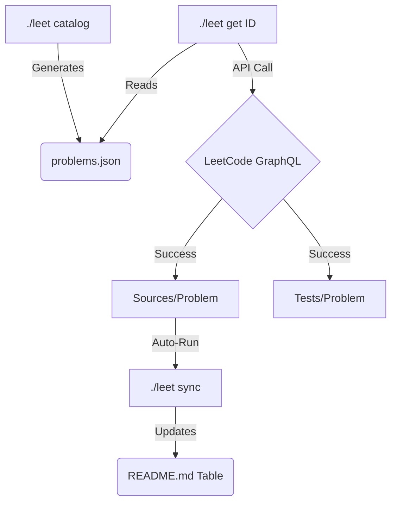

# LeetCode Swift Edition 🚀

A professional, automated, and scalable repository designed to ace LeetCode using **Swift**. Built with a focus on developer experience, automated template generation, and clean code architecture.

## 🛠 Features

- **CLI-Powered Ecosystem**: Manage your workflow with a single `./leet` command.
- **Automated Template Generation**: Fetch problem details, official code snippets, and test skeletons directly from LeetCode.
- **Dynamic Progress Tracking**: Your `README.md` table updates itself automatically as you solve problems.
- **Ready-to-Test**: Integrated with `XCTest` and Swift Package Manager (SPM).
- **CI/CD Ready**: Pre-configured GitHub Actions to validate your solutions on every push.

---

## 🚀 Getting Started

### 1. Requirements
Ensure you have the following installed:
- **Swift 5.10+** (Part of Xcode)
- **Python 3.9+** (For automation scripts)

### 2. Installation
Clone the repository and install the automation dependencies:
```bash
git clone [your-repo-url]
cd LeetCode
pip install requests
chmod +x leet
```

### 3. Initialize Catalog
Download the local problem index (over 3800 problems) to enable fetching by ID:
```bash
./leet catalog
```

---

## 🏃‍♂️ Daily Workflow

Solve problems in four simple steps:

### 1. Fetch
Generate a solution template and test file by problem ID:
```bash
./leet get 1
```

### 2. Solve
Write your solution in `Sources/[Difficulty]/[ID_Name]/[ID_Name].swift`. 

### 3. Test
Verify your implementation immediately:
```bash
./leet test
```

### 4. Sync
Update your progress table in this README:
```bash
./leet sync
```

---

## 🏗 Workflow Diagram



---

## 🛡 Security & License

- **Security**: Hardened scripts with input sanitization. See [SECURITY.md](SECURITY.md) for details.
- **License**: Distributed under the MIT License. See [LICENSE](LICENSE) for more information.

---

## 📁 Repository Structure

```text
.
├── Sources/
│   ├── Easy/             # Easy difficulty solutions
│   ├── Medium/           # Medium difficulty solutions
│   ├── Hard/             # Hard difficulty solutions
│   └── Common/           # Shared models (ListNode, TreeNode)
├── Tests/                # XCTest unit tests mirroring Sources structure
├── scripts/              # Python automation logic
└── leet                  # Unified CLI tool
```

---

## 📊 Progress Overview

| # | Problem | Difficulty | Solution | Time | Space |
|---|---------|-------------|----------|------|-------|
| - | - | - | - | - | - |

---

## 📄 License
This repository is for educational purposes. All problem descriptions are property of LeetCode.
